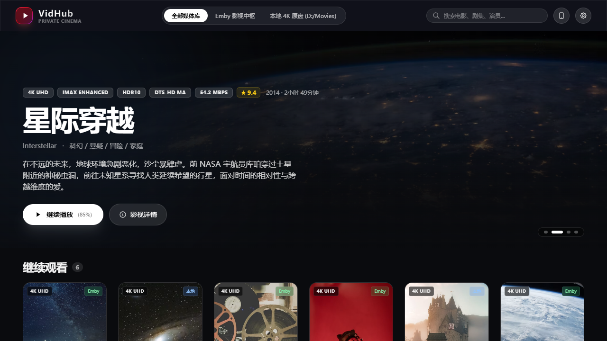
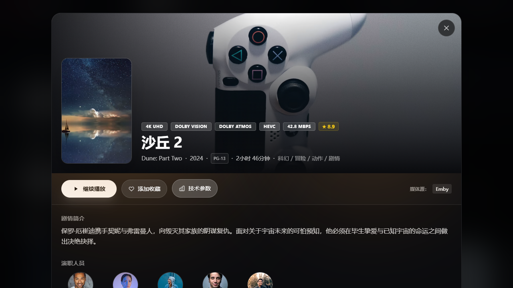
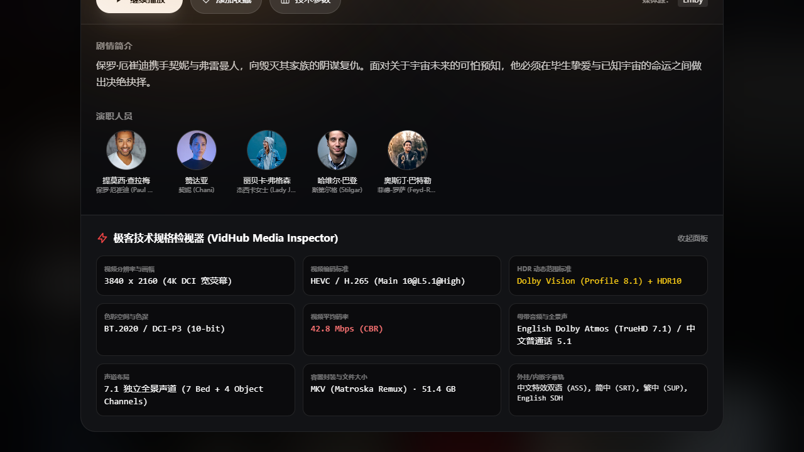
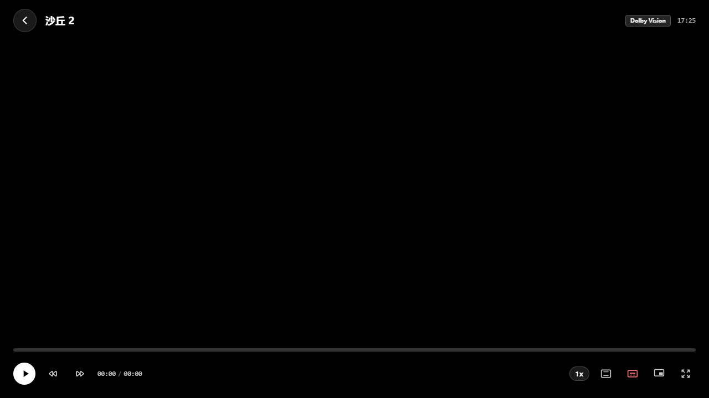
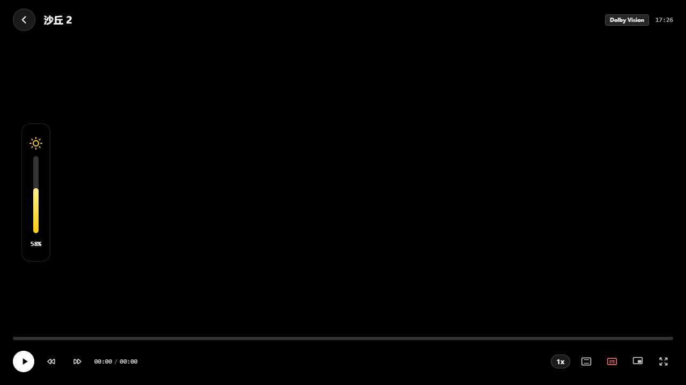
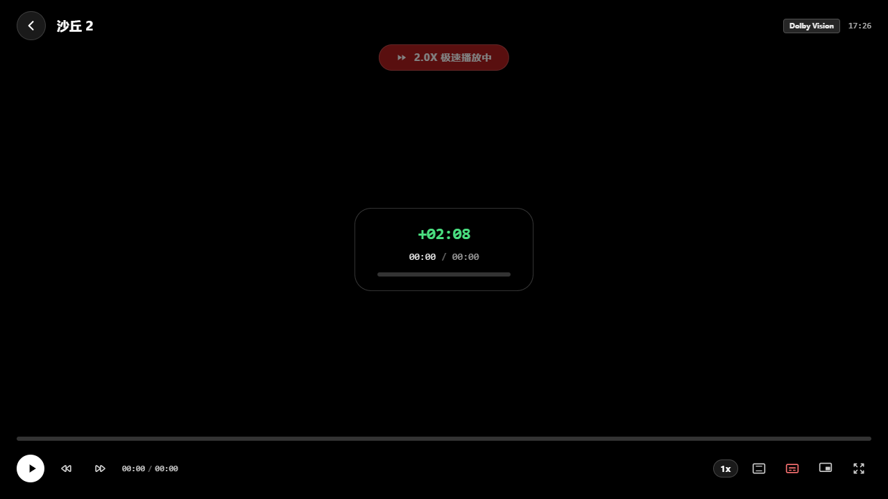
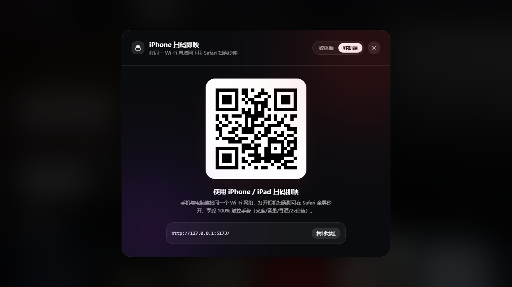
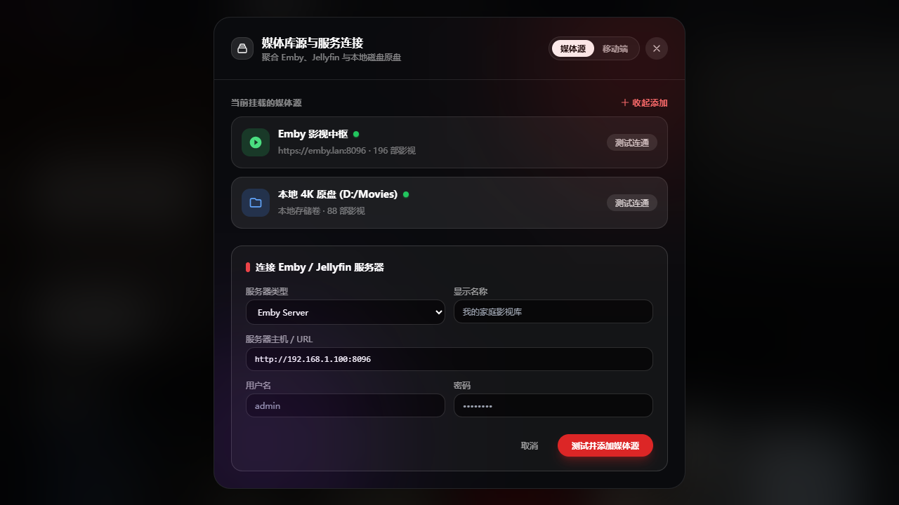



# 🔮 OnyxVision · 曜石视界

### The Obsidian-Deep Private Streaming Hub & 4K HDR Player
### 极夜曜石 · 极简私有云影音流媒体中枢

  <b>沉浸式 Apple HIG 磨砂毛玻璃</b> · <b>2:3 黄金比例海报墙</b> · <b>全手势触控播放内核</b> · <b>Emby / Jellyfin / WebDAV 全协议直连</b> · <b>iPhone 扫码即映 PWA</b>

[简体中文](#-简体中文) | [English](#-english)

---

## 📸 界面预览 / Screenshots

| 首页海报墙与 Hero Banner 轮播 | 影视详情页与动态环境光漫射 |
|:---:|:---:|
|  |  |

| 极客级音画技术参数检视器 | 全能触控手势播放器 |
|:---:|:---:|
|  |  |

| 左滑亮度调节 HUD (毛玻璃指示柱) | 长按 2.0X 极速播放 HUD |
|:---:|:---:|
|  |  |

| iPhone 扫码即映 (局域网即连二维码) | Emby / Jellyfin / WebDAV 媒体源连接 |
|:---:|:---:|
|  |  |

---

## 🇨🇳 简体中文

### 🌟 核心特性

1. **100% 苹果原生设计美学 (Apple HIG)**
   - **曜石极夜质感**：基于 #0A0B0E 深空底色，全局搭配 ackdrop-filter: blur(25px) 的高保真磨砂毛玻璃。
   - **Hero Banner 动态轮播**：50% 视高大图，底部多段渐变消融，高光标题、★TMDB 评分、极客规格角标。
   - **2:3 黄金海报网格**：自适应多端流式布局（手机 2 列、iPad 4 列、桌面 6-7 列），带已播红色进度条与 Hover 1.04x 微呼吸动效。
   - **动态环境光漫射 (Dynamic Ambient Light)**：影视详情页依据海报自动提取深邃主色调，顶部投射 140px 柔和漫反射光晕。

2. **全能触控手势播放内核**
   - **左半屏上下滑**：调节屏幕亮度（带磨砂胶囊指示柱）。
   - **右半屏上下滑**：调节音量与音频软增益（100%-200%）。
   - **水平横向滑动**：毫秒级时间轴 Seeking 与时间提示。
   - **长按屏幕 (300ms)**：临时切入 **2.0x 极速快进**，顶部浮现流光提示，松手无缝切回原速。
   - **双击左/右**：快退 10 秒 / 快进 10 秒；中央双击播放/暂停。
   - **高级控制**：倍速 (0.5x - 3.0x)、画幅比例 (适应/16:9/4:3/铺满)、ASS 特效/外挂字幕切换、画中画 (PiP)。

3. **极客级音画技术参数面板 (Specs Inspector)**
   - 1:1 调出全格式技术诊断面板：4K DCI (3840x2160)、HEVC Main 10@L5.1、Dolby Vision (Profile 8.1) + HDR10、10-bit BT.2020、42.8 Mbps 超高码率、Dolby Atmos 7.1 TrueHD 母带音频。

4. **多源虚拟文件系统 (VFS) 与双向同步**
   - **Emby / Jellyfin 协议原生直连**：支持地址、端口、账号密码或 API Key 登录；构建 static=true 原画 Direct Play 直通，完全跳过服务端压制；全生命周期回传 10 秒心跳播放进度，已看/未看状态实时对齐。
   - **WebDAV / Alist 挂载**：支持挂载各类私有 NAS、阿里云盘、网盘聚合。
   - **本地影视扫库**：内置多阶段正则清洗器，剥离压制组与技术标签，对接 TMDB API v3 智能刮削。

5. **iPhone / iPad 扫码即映 (PWA 模式)**
   - 启动后控制台与前端自动生成**局域网访问二维码**。
   - iPhone 打开相机扫码打开，点击 Safari 底部的 **“分享” -> “添加到主屏幕”**，即可享受 100% 无边框沉浸全屏与原生触控手势！

---

### 🚀 快速启动

#### 方式一：Windows 一键启动 (推荐)
直接双击运行工程根目录下的：
`at
run_onyxvision.bat
`
系统将自动启动后端服务，并在 2 秒后自动在默认浏览器中打开 OnyxVision 首页：http://127.0.0.1:8000。

#### 方式二：命令行手动启动
`ash
# 安装依赖
pip install -r backend/requirements.txt

# 启动服务
python backend/run.py
`

---

## 🇺🇸 English

### 🌟 Key Features
- **Obsidian Dark & Frosted Glass**: Built with Apple Human Interface Guidelines (HIG) aesthetics, frosted glass blur (ackdrop-filter: blur(25px)), and dynamic ambient lighting extracted from posters.
- **Full Touch Gesture Player**: Left-swipe brightness, right-swipe volume boost, horizontal seek with HUD timestamp, long-press 2.0x fast-forward, double-tap jump +/-10s, and aspect ratio controls.
- **Specs Inspector**: Detailed media diagnostic drawer (4K DCI, HEVC 10-bit, Dolby Vision Profile 8.1, Atmos 7.1, 42.8 Mbps).
- **Multi-Source VFS**: Direct Play streaming for Emby, Jellyfin, WebDAV, Alist, and local disk folders with TMDB v3 automatic metadata scraping.
- **Bi-directional Scrobbling**: Full playback progress heartbeat (Playing, Progress, Stopped) and played status sync with Emby servers.
- **Instant LAN QR Code for iPhone**: Generates dynamic QR codes for mobile devices on the same Wi-Fi. Add to home screen for a seamless PWA experience.

---

## 🏗️ 架构概览 / Architecture

`
+-------------------------------------------------------------------------------+
|                       OnyxVision Web / PWA Frontend                           |
|  [Apple HIG Dark UI]  [Hero Carousel]  [2:3 Poster Grid]  [Dynamic Lighting]  |
|  [Full-Screen Gesture Player (Brightness / Volume / Seek / 2x Turbo / PiP)]   |
+-------------------------------------------------------------------------------+
                                       | (REST API / Range 206 Direct Stream)
+-------------------------------------------------------------------------------+
|                     OnyxVision Core Backend (FastAPI)                         |
|  +------------------------+  +------------------------+  +-----------------+  |
|  | Emby / Jellyfin Engine |  | WebDAV / Local Storage |  | TMDB Scraper v3 |  |
|  +------------------------+  +------------------------+  +-----------------+  |
|  +-------------------------------------------------------------------------+  |
|  | HTTP Range 206 Partial Content Streamer & Bi-directional Scrobbler      |  |
|  +-------------------------------------------------------------------------+  |
+-------------------------------------------------------------------------------+
                                       |
                     [SQLite WAL Local Metadata Cache]
`

---

## 📜 开源协议 / License

本项目采用 [MIT License](LICENSE) 授权许可。